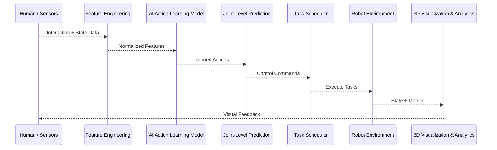

<h1 align="center"> <span style="color:#4F46E5">Actirion</span><span style="color:#16A34A">Robo</span></h1>

<p align="center">
  
</p>

<p align="center">
  <b>An AI-driven 3D robotic action learning and control platform with real-time visualization.</b>
</p>

<p align="center">
  
  
  
  
</p>

<p align="center">
  <a href="https://github.com/dhakarshailendra829/AI_Robot_3D_Simulator">Star Repository</a> •
  <a href="#-problem--motivation">Problem</a> •
  <a href="#-solution-overview">Solution</a> •
  <a href="#-system-architecture">Architecture</a> •
  <a href="#-core-capabilities">Capabilities</a> •
  <a href="#-benchmarks--experiments">Benchmarks</a> •
  <a href="#-installation--execution">Installation</a>
</p>

---

## Problem & Motivation

Robotics development often suffers from fragmented systems where learning, control, and visualization are handled in isolation. This creates challenges in:

Understanding how AI decisions translate into robot actions

Evaluating learned behaviors beyond raw accuracy

Scaling experimental robotics systems toward industry workflows

---

## Solution Overview

**ActirionRobo** is a modular AI-centric robotics platform that unifies:

Action learning from data

Task-level scheduling and execution

Real-time 3D visualization

System analytics and benchmarking

---

## Core Capabilities

### AI-Based Action Learning
- Implemented behavior cloning models using PyTorch to learn robotic joint trajectories
- Transformed human–object interaction data into robot joint-level actions
- Enabled smooth and continuous motion prediction

### Task Scheduling & Control
- Queue-based scheduler supporting `pick`, `place`, `move`, `sort`
- Autoplay, step-wise execution, pause, and reset functionality

### Dual Control Modes
- Manual joint-level control via UI
- Autonomous AI-driven execution with safe interpolation

### Real-Time 3D Visualization
- Live robotic arm animation
- Trajectory and state rendering synchronized with execution

### Analytics & Monitoring
- Inference latency tracking
- Task execution timelines
- System resource monitoring

---

## System Architecture
flowchart TD
    U[User / Operator] --> UI[Interactive Web UI\n(Streamlit + Plotly)]

    UI --> TS[Task Scheduler & Control Layer]

    TS --> AI[AI Learning & Inference Engine\n(PyTorch)]

    AI --> ENV[Robot Environment Core]

    ENV --> VIS[3D Visualization & Analytics Engine]

    VIS --> UI


## End-to-End Workflow

---

## Benchmarks & Experiments

### Evaluation Metrics
- Trajectory Error (MSE)
- Task Completion Rate
- Execution Smoothness
- Inference Latency
- Joint Stability

### Experimental Setup
- Fixed task sequences across runs
- Identical environment initialization
- Controlled random seeds for reproducibility

### Sample Results

| Experiment | Task Type     | Avg MSE | Completion Rate |
|-----------|---------------|--------|-----------------|
| Exp-01    | Pick & Place  | 0.021  | 96%             |
| Exp-02    | Sorting       | 0.034  | 91%             |

---

## Planned Extensions

- Reinforcement Learning (Gym / Gymnasium)
- ROS 2 integration
- Physics-aware collision handling
- REST / WebSocket APIs
- Multi-robot coordination
- Cloud-based experiment execution

---

## Tech Stack

- **AI & ML:** Python, PyTorch, NumPy, Pandas  
- **Visualization:** Streamlit, Plotly  
- **System Engineering:** Modular Python architecture  
- **Monitoring:** psutil, logging utilities  

---

## Installation & Execution

```bash
git clone https://github.com/dhakarshailendra829/AI_Robot_3D_Simulator.git
cd AI_Robot_3D_Simulator
pip install -r requirements.txt
streamlit run app.py
```
## Project Status

ActirionRobo is an open-source, academic, and experimental platform intended for learning, research, and system prototyping.  
It is not affiliated with any commercial robotics product.

---

## 👤 Author

**Shailendra Dhakad**  
AI • Robotics • Software Systems Engineering

